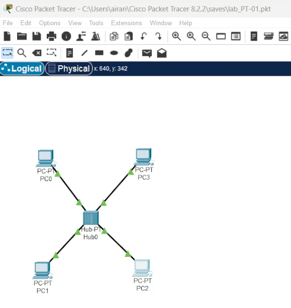

---
## Front matter
title: "Знакомство с Cisco Packet Tracer"
subtitle: "Лабораторная работа № 1"
author: "Шулуужук Айраана НПИбд-02-22"

## Generic otions
lang: ru-RU
toc-title: "Содержание"

## Bibliography
bibliography: bib/cite.bib
csl: pandoc/csl/gost-r-7-0-5-2008-numeric.csl

## Pdf output format
toc: true # Table of contents
toc-depth: 2
lof: true # List of figures
lot: true # List of tables
fontsize: 12pt
linestretch: 1.5
papersize: a4
documentclass: scrreprt
## I18n polyglossia
polyglossia-lang:
  name: russian
  options:
	- spelling=modern
	- babelshorthands=true
polyglossia-otherlangs:
  name: english
## I18n babel
babel-lang: russian
babel-otherlangs: english
## Fonts
mainfont: IBM Plex Serif
romanfont: IBM Plex Serif
sansfont: IBM Plex Sans
monofont: IBM Plex Mono
mathfont: STIX Two Math
mainfontoptions: Ligatures=Common,Ligatures=TeX,Scale=0.94
romanfontoptions: Ligatures=Common,Ligatures=TeX,Scale=0.94
sansfontoptions: Ligatures=Common,Ligatures=TeX,Scale=MatchLowercase,Scale=0.94
monofontoptions: Scale=MatchLowercase,Scale=0.94,FakeStretch=0.9
mathfontoptions:
## Biblatex
biblatex: true
biblio-style: "gost-numeric"
biblatexoptions:
  - parentracker=true
  - backend=biber
  - hyperref=auto
  - language=auto
  - autolang=other*
  - citestyle=gost-numeric
## Pandoc-crossref LaTeX customization
figureTitle: "Рис."
tableTitle: "Таблица"
listingTitle: "Листинг"
lofTitle: "Список иллюстраций"
lotTitle: "Список таблиц"
lolTitle: "Листинги"
## Misc options
indent: true
header-includes:
  - \usepackage{indentfirst}
  - \usepackage{float} # keep figures where there are in the text
  - \floatplacement{figure}{H} # keep figures where there are in the text
---

# Цель работы

Установка инструмента моделирования конфигурации сети Cisco Packet Tracer, знакомство с его интерфейсом

# Задание

1. Установить на домашнем устройстве Cisco Packet Tracer.
2. Постройте простейшую сеть в Cisco Packet Tracer, проведите простейшую настройку оборудования

# Выполнение лабораторной работы

Создадим проект под названием lab_PT-01.pkt. В рабочем пространстве разместим концентратор (Hub-PT) и четыре оконечных устройства PC. Соединим оконечные устройства с концентратором прямым кабелем (рис. [-@fig:001]).

{#fig:001 width=70%}

Щёлкнув последовательно на каждом оконечном устройстве, зададим статические IP-адреса 192.168.1.11, 192.168.1.12,
192.168.1.13, 192.168.1.14 с маской подсети 255.255.255.0 (рис. [-@fig:002]).

{#fig:002 width=70%}

В основном окне проекта перейдем из режима реального времени (Realtime) в режим моделирования (Simulation). Выберим на панели инструментов мышкой «Add Simple PDU (P)» и щёлкнем сначала на PC0, затем на PC2. В рабочей области появились два конверта, обозначающих пакеты, в списке событий на панели моделирования должны появиться
два события, относящихся к пакетам ARP и ICMP соответственно. На панели моделирования нажмем кнопку «Play» и проследите за движением пакетов ARP и ICMP от устройства PC0 до устройства PC2 и обратно (рис. [-@fig:003]).

{#fig:003 width=70%}

Щёлкнув на строке события, откроем окно информации о PDU и изучим, что происходит на уровне модели OSI при перемещении пакета (рис. [-@fig:004]).

{#fig:004 width=70%}

Используя кнопку «Проверь себя» (Challenge Me) на вкладке OSI Model, ответим на вопросы (рис. [-@fig:005]).

{#fig:005 width=70%}

Откроем вкладку с информацией о PDU. Исследуем структуру пакета ICMP. Опишем структуру кадра Ethernet и MAC-адресов (рис. [-@fig:006]).

{#fig:006 width=70%}

Очистим список событий, удалив сценарий моделирования. Выберем на панели инструментов мышкой «Add Simple PDU (P)» и щёлкнем сначала на PC0, затем на PC2. Снова выберем на панели инструментов мышкой «Add Simple PDU (P)» и щёлкнем сначала на PC2, затем на PC0. На панели моделирования нажмем кнопку «Play» и проследим за возникновением
коллизии (рис. [-@fig:007]).

{#fig:007 width=70%}

В списке событий посмотрим информацию о PDU (рис. [-@fig:008]).

{#fig:008 width=70%}

Перейдем в режим реального времени (Realtime). В рабочем пространстве разместим коммутатор Cisco 2950-24 и 4 оконечных устройства PC. Соединим оконечные устройства с коммутатором прямым кабелем (рис. [-@fig:009]).

{#fig:009 width=70%}

Щёлкнув последовательно на каждом оконечном устройстве, зададим статические IP-адреса 192.168.1.21, 192.168.1.22, 192.168.1.23, 192.168.1.24 с маской подсети 255.255.255.0 (рис. [-@fig:010]).

{#fig:010 width=70%}

В основном окне проекта перейдем из режима реального времени (Realtime) в режим моделирования (Simulation). Выберем на панели инструментов мышкой «Add Simple PDU (P)» и щёлкнем сначала на PC4, затем на PC6. На панели моделирования нажмем кнопку «Play» и проследим за движением пакетов ARP и ICMP от устройства PC4 до устройства PC6
и обратно (рис. [-@fig:011]).

{#fig:011 width=70%}

Исследуем структуру пакета ICMP. Опишем структуру кадра Ethernet и MAC-адресов (рис. [-@fig:012]).

{#fig:012 width=70%}

Очистим список событий, удалив сценарий моделирования. Выберем на панели инструментов мышкой «Add Simple PDU (P)» и щёлкнем сначала на PC4, затем на PC6. Снова выберем на панели инструментов мышкой «Add Simple PDU (P)» и щёлкните сначала на PC6, затем на PC4. На панели моделирования нажмем кнопку «Play» и проследим за движением пакетов. В результате не возникает коллизия (рис. [-@fig:013]).

{#fig:013 width=70%}

Перейдем в режим реального времени (Realtime). В рабочем пространстве соединим кроссовым кабелем концентратор и коммутатор (рис. [-@fig:014]).

{#fig:014 width=70%}

Перейдем в режим моделирования (Simulation). Очистим список событий, удалив сценарий моделирования. Выберем на панели инструментов мышкой «Ad Simple PDU (P)» и щёлкнем сначала на PC0, затем на PC4. Снова выберем на панели инструментов мышкой «Add Simple PDU (P)» и щёлкнем сначала на PC4, затем на PC0. На панели моделирования нажмем кнопку «Play» и проследим за движением пакетов. В результате сначала возникает коллизия, а затем пакеты успешно достигают пункта назначения (рис. [-@fig:015]).

{#fig:015 width=70%}

Очистим список событий, удалив сценарий моделирования. На панели моделирования нажмите «Play» и в списке событий получим пакеты STP (рис. [-@fig:016]).

{#fig:016 width=70%}

Исследуем структуру STP. Опишем структуру кадра Ethernet и MAC-адресов (рис. [-@fig:017]).

{#fig:017 width=70%}

Перейдем в режим реального времени (Realtime). В рабочем пространстве добавим маршрутизатор Cisco 2811. Соединим прямым кабелем коммутатор и маршрутизатор (рис. [-@fig:018]).

{#fig:018 width=70%}

Щелкнем на маршрутизаторе и на вкладке его конфигурации пропишем статический IP-адрес 192.168.1.254 с маской 255.255.255.0, активируем порт, поставив галочку «On» напротив «Port Status» (рис. [-@fig:019]).

{#fig:019 width=70%}

Перейдем в режим моделирования (Simulation). Очистим список событий, удалив сценарий моделирования. Выберем на панели инструментов мышкой «Add Simple PDU (P)» и щёлкнем сначала на PC3, затем на маршрутизаторе. На панели моделирования нажмем кнопку «Play» и проследим за движением пакетов ARP, ICMP, STP и CDP (рис. [-@fig:020]).

{#fig:020 width=70%}

Исследуем структуру пакета CDP, опишем структуру кадра Ethernet и MAC-адресов (рис. [-@fig:021]).

{#fig:021 width=70%}

# Выводы

В результате выполнения лабораторной работы был установлен инструмент моделирования конфигурации сети Cisco Packet Tracer, а также познакомились с его интерфейсом

# Контрольные вопросы

1. Дайте определение следующим понятиям: концентратор, коммутатор, марш-
рутизатор, шлюз (gateway). В каких случаях следует использовать тот или
иной тип сетевого оборудования?

Ответ: Концентратор — это простое сетевое устройство, которое соединяет несколько компьютеров в локальной сети (LAN). Он работает на физическом уровне модели OSI и передает данные, полученные от одного устройства, ко всем остальным, не делая различий между ними. Концентраторы используются в небольших сетях, где не требуется высокая производительность и управление трафиком. Однако в современных сетях они практически не применяются из-за своей неэффективности и ограниченных возможностей.

Коммутатор — это устройство, которое соединяет устройства в локальной сети и управляет передачей данных между ними на канальном уровне модели OSI. Он анализирует MAC-адреса и направляет данные только к нужному устройству. Коммутаторы используются в большинстве современных локальных сетей, так как они обеспечивают более эффективное использование полосы пропускания и уменьшают количество коллизий по сравнению с концентраторами.

Маршрутизатор — это устройство, которое соединяет разные сети и управляет передачей данных между ними на сетевом уровне модели OSI. Он использует IP-адреса для определения наилучшего пути для передачи данных. Маршрутизаторы используются для соединения локальных сетей с интернетом или другими сетями. Они необходимы в ситуациях, когда требуется маршрутизация трафика между различными сетями или сегментами.

Шлюз — это устройство или программное обеспечение, которое служит точкой входа и выхода между различными сетями, часто с различными протоколами. Он может выполнять преобразование данных между несовместимыми системами. Шлюзы используются, когда необходимо соединить сети с различными протоколами или архитектурами. Например, они могут использоваться для подключения локальной сети к интернету, если требуется преобразование данных между различными форматами.

2. Дайте определение следующим понятиям: ip-адрес, сетевая маска, broadcast-
адрес.

Ответ: IP-адрес - это уникальный числовой идентификатор, присваиваемый каждому устройству в сети, использующей протоколы TCP/IP. IP-адрес позволяет устройствам идентифицировать и адресовать друг друга для передачи данных. IP-адрес может быть статическим (постоянным) или динамическим (изменяющимся) и состоит из четырёх десятичных чисел, разделённых точками (например, 192.168.1.1 для IPv4) или из восьми групп шестнадцатеричных чисел, разделённых двоеточиями (например, 2001:0db8:85a3:0000:0000:8a2e:0370:7334 для IPv6).

Сетевая маска - это числовое обозначение, которое определяет, какая часть IP-адреса принадлежит сети, а какая — конкретному устройству (хосту) в этой сети. Сетевая маска используется для разделения IP-адреса на две части: сеть (network) и хост (host). В IPv4 сетевая маска также состоит из четырёх десятичных чисел (например, 255.255.255.0). Сетевая маска определяет диапазон адресов, доступных в данной локальной сети.

Broadcast-адрес - это специальный IP-адрес, используемый для отправки данных всем устройствам в сети одновременно. Broadcast-адрес обычно обозначается путем установки всех битов хостовой части IP-адреса в 1. Например, если у вас есть сеть с сетевой маской 255.255.255.0 и IP-адрес 192.168.1.0, то broadcast-адрес будет 192.168.1.255. Этот адрес позволяет отправлять сообщения всем устройствам в локальной сети без необходимости указания каждого IP-адреса отдельно.

3. Как можно проверить доступность узла сети?

Ответ: Ping - это самый простой и часто используемый способ проверки доступности узла. Команда ping отправляет ICMP (Internet Control Message Protocol) эхо-запросы к указанному IP-адресу или доменному имени и ожидает ответа. Если узел доступен, он ответит, и вы увидите время отклика. 
