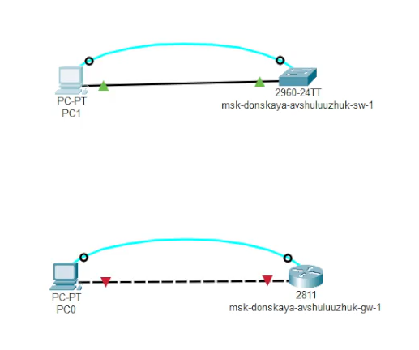
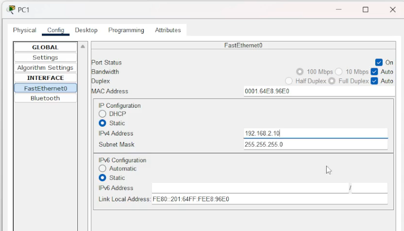
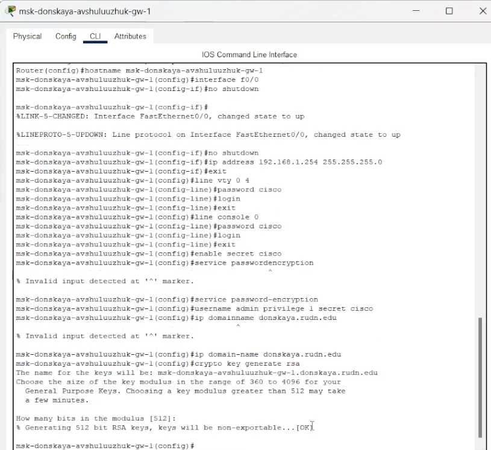
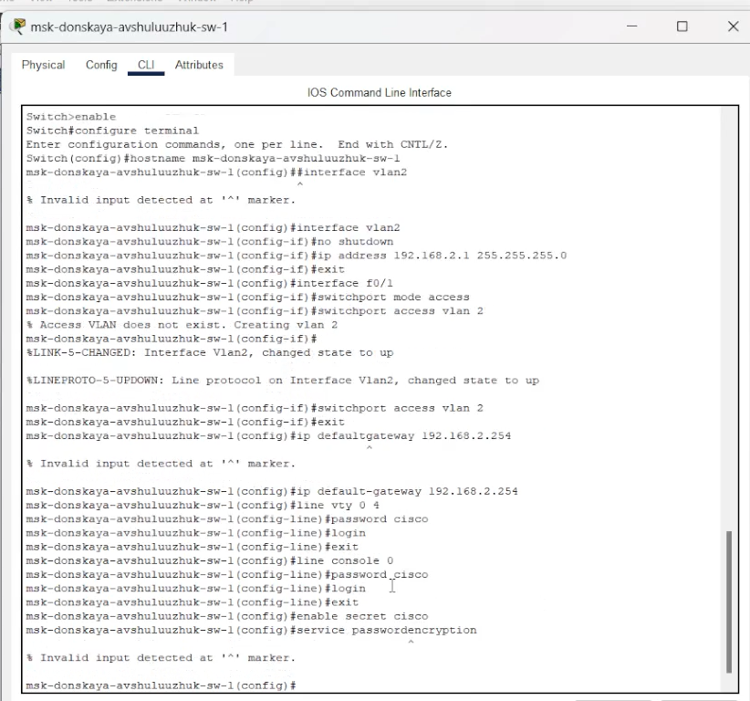
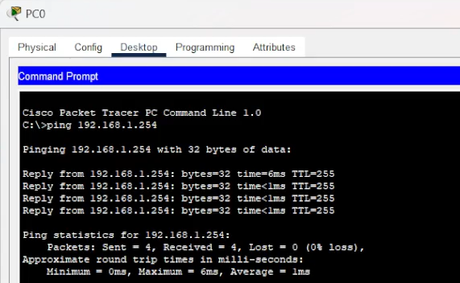
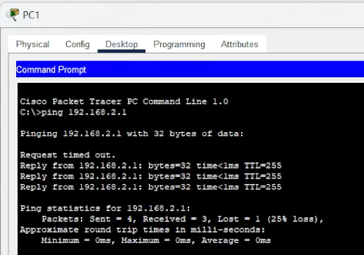
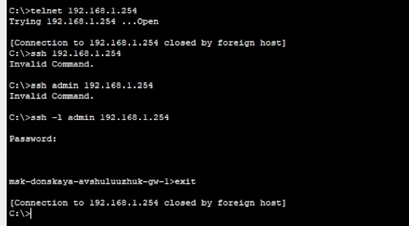
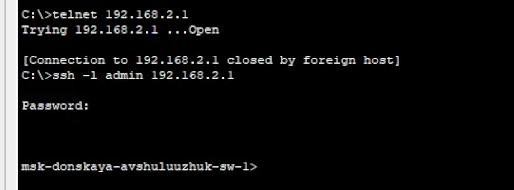

---
## Front matter
title: "Предварительная настройка оборудования Cisco"
subtitle: "Лабораторная работа № 2"
author: "Шулуужук Айраана НПИбд-02-22"

## Generic otions
lang: ru-RU
toc-title: "Содержание"

## Bibliography
bibliography: bib/cite.bib
csl: pandoc/csl/gost-r-7-0-5-2008-numeric.csl

## Pdf output format
toc: true # Table of contents
toc-depth: 2
lof: true # List of figures
lot: true # List of tables
fontsize: 12pt
linestretch: 1.5
papersize: a4
documentclass: scrreprt
## I18n polyglossia
polyglossia-lang:
  name: russian
  options:
	- spelling=modern
	- babelshorthands=true
polyglossia-otherlangs:
  name: english
## I18n babel
babel-lang: russian
babel-otherlangs: english
## Fonts
mainfont: IBM Plex Serif
romanfont: IBM Plex Serif
sansfont: IBM Plex Sans
monofont: IBM Plex Mono
mathfont: STIX Two Math
mainfontoptions: Ligatures=Common,Ligatures=TeX,Scale=0.94
romanfontoptions: Ligatures=Common,Ligatures=TeX,Scale=0.94
sansfontoptions: Ligatures=Common,Ligatures=TeX,Scale=MatchLowercase,Scale=0.94
monofontoptions: Scale=MatchLowercase,Scale=0.94,FakeStretch=0.9
mathfontoptions:
## Biblatex
biblatex: true
biblio-style: "gost-numeric"
biblatexoptions:
  - parentracker=true
  - backend=biber
  - hyperref=auto
  - language=auto
  - autolang=other*
  - citestyle=gost-numeric
## Pandoc-crossref LaTeX customization
figureTitle: "Рис."
tableTitle: "Таблица"
listingTitle: "Листинг"
lofTitle: "Список иллюстраций"
lotTitle: "Список таблиц"
lolTitle: "Листинги"
## Misc options
indent: true
header-includes:
  - \usepackage{indentfirst}
  - \usepackage{float} # keep figures where there are in the text
  - \floatplacement{figure}{H} # keep figures where there are in the text
---

# Цель работы

Получить основные навыки по начальному конфигурированию оборудования Cisco.

# Задание

1. Сделать предварительную настройку маршрутизатора:
– задать имя в виде «город-территория-учётная_запись-тип_оборудования-номер»;
– задать интерфейсу Fast Ethernet с номером 0 ip-адрес 192.168.1.254 и маску 255.255.255.0, затем поднять интерфейс;
– задать пароль для доступа к привилегированному режиму (сначала в открытом виде, затем — в зашифрованном)
– настроить доступ к оборудованию сначала через telnet, затем — через ssh (используя в качестве имени домена donskaya.rudn.edu);
– сохранить и экспортировать конфигурацию в отдельный файл.
2. Сделать предварительную настройку коммутатора:
– задать имя в виде «город-территория-учётная_запись-тип_оборудования-номер»;
– задать интерфейсу vlan 2 ip-адрес 192.168.2.1 и маску 255.255.255.0, затем поднять интерфейс;
– привязать интерфейс Fast Ethernet с номером 1 к vlan 2;
– задать в качестве адреса шлюза по умолчанию адрес 192.168.2.254;
– задать пароль для доступа к привилегированному режиму (сначала в открытом виде, затем — в зашифрованном);
– настроить доступ к оборудованию сначала через telnet, затем — через ssh (используя в качестве имени домена donskaya.rudn.edu);
– для пользователя admin задать доступ 1-го уровня по паролю;
– сохранить и экспортировать конфигурацию в отдельный файл.

# Выполнение лабораторной работы

В логической рабочей области Packet Tracer разместим коммутатор, маршрутизатор и 2 оконечных устройства типа PC, соединим один PC с маршрутизатором, другой PC — с коммутатором (рис. [-@fig:001]).

{#fig:001 width=70%}

Щёлкнув последовательно на каждом оконечном устройстве, зададим статические IP-адреса 192.168.1.10, 192.168.2.10 с маской подсети 255.255.255.0 (рис. [-@fig:002]).

{#fig:002 width=70%}

Проведем настройку маршрутизатора в соответствии с заданием (рис. [-@fig:003]).

{#fig:003 width=70%}

Проведем настройку коммутатора в соответствии с заданием (рис. [-@fig:004]).

{#fig:004 width=70%}

Проверим работоспособность соединений с помощью команды ping (рис. [-@fig:005]) (рис. [-@fig:006])

{#fig:005 width=70%}

{#fig:006 width=70%}

Попробуем подключиться к коммутатору и маршрутизатору по протоколу удалённого доступа (telnet, ssh) (рис. [-@fig:007]) (рис. [-@fig:008]).

{#fig:007 width=70%}

{#fig:008 width=70%}

# Выводы

В результате выполнения лабораторной работы были получены основные навыки по начальному конфигурированию оборудования Cisco.

# Контрольные вопросы

1. Укажите возможные способы подключения к сетевому оборудованию.

Ответ: физическое подключение, беспроводное подключение, удаленное подключение.

2. Каким типом сетевого кабеля следует подключать оконечное оборудование пользователя к маршрутизатору и почему?

Ответ: Для подключения оконечного оборудования пользователя к маршрутизатору наиболее подходящим типом сетевого кабеля является Категория 5e (Cat5e) или Категория 6 (Cat6) витая пара.

3. Каким типом сетевого кабеля следует подключать оконечное оборудование пользователя к коммутатору и почему?

Ответ: Для подключения оконечного оборудования пользователя к commutator (коммутатору) следует подключать Категория 5e (Cat5e) или Категория 6 (Cat6) витая пара.

4. Каким типом сетевого кабеля следует подключать коммутатор к коммутатору и почему?

Ответ: Для подключения коммутатора к коммутатору следует использовать Категория 6 (Cat6) или Категория 7 (Cat7) витая пара.

5. Укажите возможные способы настройки доступа к сетевому оборудованию по паролю.

Ответ: локальный доступ, удаленный доступ (telnet), удаленный доступ (SSH - Secure Shell), SNMP (Simple Network Management Protocol)

6. Укажите возможные способы настройки удалённого доступа к сетевому оборудованию. Какой из способов предпочтительнее и почему?

Ответ: SSH является предпочтительным способом для удаленного доступа к сетевому оборудованию.
Причины:
-Безопасность: SSH обеспечивает шифрование всего трафика, включая пароли и команды, что защищает данные от перехвата.
-Аутентификация: SSH поддерживает аутентификацию по паролю и ключам, что позволяет реализовать более надежные механизмы аутентификации.
-Надежность: SSH - хорошо зарекомендовавший себя протокол, который широко поддерживается и регулярно обновляется для исправления уязвимостей.
-Гибкость: SSH позволяет выполнять широкий спектр задач, от настройки оборудования до управления им.
